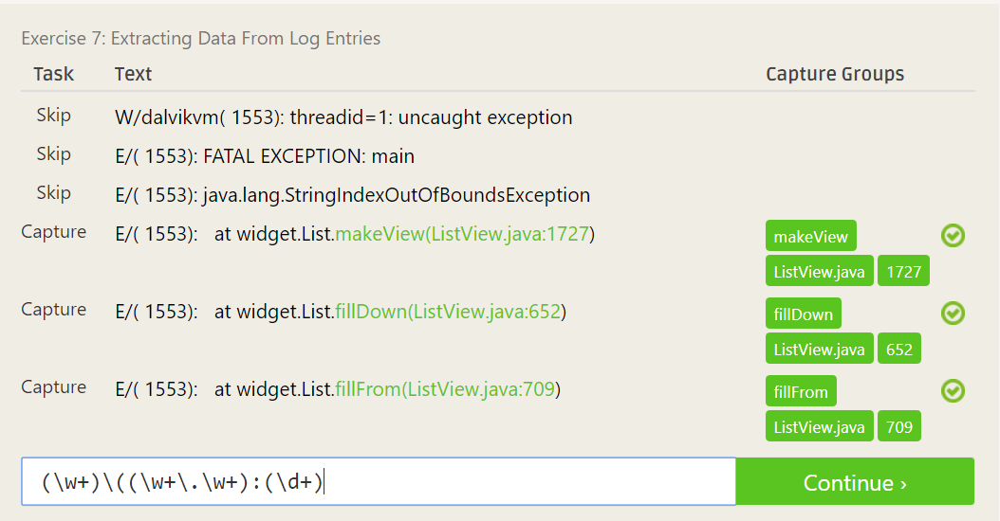

## Reflection 
### 10 criteria of Open Source Definition
The 10 criteria listed by the OSI defines what should and should not be done
in an open source license. This is important because it effectively controls 
the distribution of software using these criteria. For example if these 
distribution rules weren't here there would be nothing stopping people re-selling 
open source software. It also stops other individuals from unfairly using open source software by setting rules on modification and distributed works. These rules help protect the open source community by allowing members to contribute without fear their work will be unfairly used.

### Smart Questions
Knowing how to ask smart questions is important because it helps you learn effectively by knowing what to ask and it also teaches you how to get the better answers. I was surprised with the how the article defends members being openly against certain types of questions but at the end I agree their reasoning behind this that its OK to be ignorant but not OK to play stupid.

I find it helps when you're looking to learn best practices and tips or starting 
to work on a project to frame the question less of asking for help and more on asking how the person you're asking would solve a problem. For example, asking "How would you go about solving this problem" or "Have you tried doing something similar to this before". This could save a lot of headache if someone has ran into issues they could save you from.

I've never used an IRC or email list before to ask help but I think something similar is to have a general slack channel for a project. Where more open ended questions can be answered that way if someone happens to know they can respond instead of going to individual people and seeing if they know the solution.

### Free Culture
First of all it was really cool to see RPI mentioned and praised for its technical strength somewhere other than an accepted students day :) . The idea of not having a search engine feels so strange, growing up with google its often a foreign concept of not having massive indexes of data at your fingertips. It was absurd that the RIAA considered this pirating especially since it sounds like all Jesse worked on was the file explorer system and non of the content itself. If all this was on RPI's network at the time, other internet search engines must of had magnitudes more that the RIAA conveniently overlooked. The fact the RIAA wanted 100 billion across all these college students is insane! Any person would see how unreasonable that is even if anyone did pirate anything which from this chapter sounds like they did not. The chapter ends with Jesse becoming an activist but just stops there. The next chapter doesn't mention him either so I thats kind of annoying, I want to know how his story ended. It would be nice if he could something out of this. This chapter makes me want to pirate music now!

### Regex
#### (Here are the solutions before num. 7)
	\d$
	[0-9]{3}  (this one might be bugged I think even they're solution didn't work)   
	^[a-z]+\.?[a-z]+
	<(\w+)
	(\w+)\.(jpg|png|gif)$
	\S?([a-zA-Z.\s{1}])+

