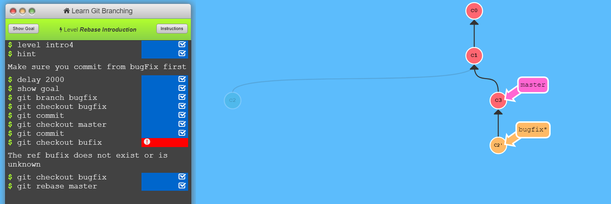

The Repo I made :[Lab 2 Repo ](https://github.com/shailpatels/lab2part1)

Git stuff:

My Forked Repo:
[Forks](https://github.com/shailpatels/Spoon-Knife)

Learn Git branching

Forked from PullReq: [Forks2](https://github.com/shailpatels/PullReq)

Diff:

Tagging : 

Common Repo for table 1
[Table1](https://github.com/prashb99/OSSProjectIdeas)
