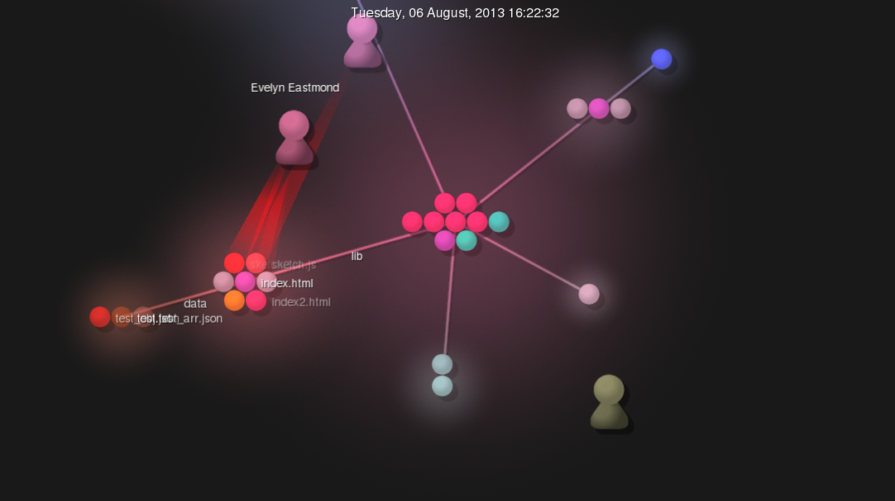

## Documentation

I'd like to continue working on OpenBooks, which is an open source project 
that was started at the last HackRPI. Its goal is to provide an alternative to 
traditional textbooks by giving a simple to use compiler and syntax to build
more interactive and collaborative webpages that act as textbooks. 

The compiler is written in Python3 and the syntax is still being designed for 
the most part. Some basic features are header and paragraph tags like markdown
and adding images. There is also an option for embedding latex. A long term
future goal I'd like to have is a website for displaying these books, something
similar to dockerhub or github

## 2

## 3

## Community
# Project:  p5.js

- 264 Contributors
- 225319 Lines of Code
- First commit: 

	2bccc6c3d7184622419672d526db2bd35e46b6dd

	Author: Lauren McCarthy <laurmccarthy@gmail.com>

	Date:   Mon Feb 25 19:14:47 2013 -0800
    Initial commit  
- Latest commit: 

	commit 60deb1efba8593047d95091efeb5318150abc82f

	Author: Sanket Singh <24548786+sanketsingh24@users.noreply.github.com>
	
	Date:   Tue Mar 12 19:35:40 2019 +0530

	Feature: Implemented shininess() (#3489)

	* Implemented shininess()

	* Updated manual test example for shininess()

	* updated example for shininess()

	* Added changes from #3535

	* Modified example and minimum value for shininess()

	* Corrected docs for uShininess

	* added unit test for shininess

- There are 4 branches:
	- master
	- WebGL_GSOC17
	- webgl-gsoc-2018
	- p5.sound-0.3.10

Link to [other projects](https://github.com/LingCheng3273/OSS-Exercises/blob/master/RCOSProjects.md)

#5 
The number of authors is different, gitstats lists 333, which is different than the number listed on GitHub
The number of lines is also different, gitstats reports 130660. 
Heres the total output:

[gitstats](out/index.html)

