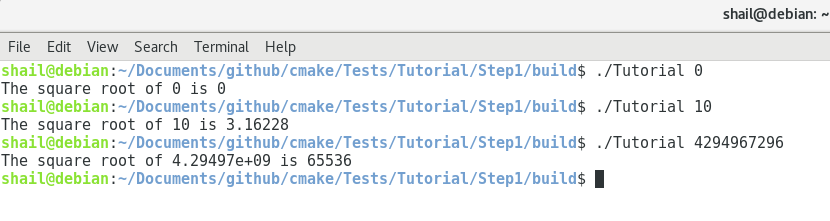
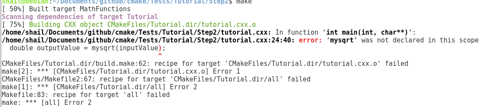
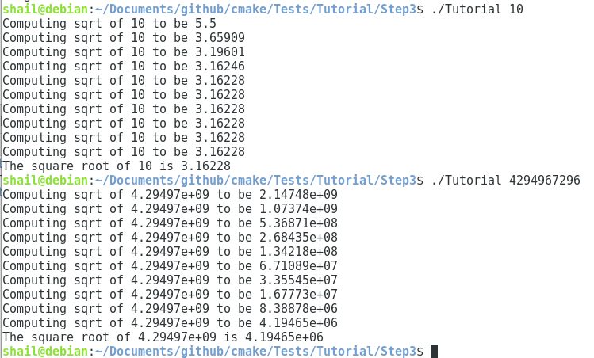
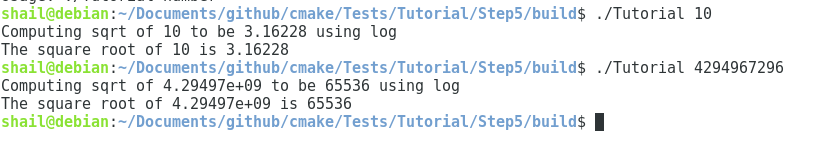
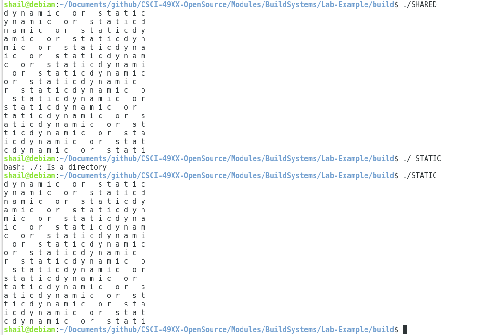

## Step 1

[CMakeList.txt](CMakeLists.txt)

[tutorial.cxx](TutorialConfig.h.in)

## Step 2
I ran into a lot of issues here, I tried leaving all the build
files in their own folder inside of `Step2/build` but that didn't work.
After running Cmake in the same level as everything else, the make file
kept spitting out errors. It couldn't recognize the `mysqrt` function.
I ended up copying the CMakeLists file from step 3 and that didn't fix it either,
not sure why its broken :/

## Step 3

[CmakeList](CMakeLists2.txt)

## Step 4

Here is the test output, (I couldn't fit it 
in a screenshot)

[testOutput](testOutput.txt)

CMakeLists (upper level) :
[CMakeLists3.txt](CMakeLists3.txt)

Cmake (Math functions):
[CMakeListsMath](CMakeListsMath3.txt)

## Step 5
CMakeLists (upper level) :
[CMakeLists5.txt](CMakeLists5.txt)

Cmake (Math functions):
[CMakeListsMath](CMakeLists5Math.txt)

The output for number 10 was the same as the other method, but for the really big number 
this method gave the correct value but the
previous method gave a really wrong answer.

## The other part of the lab

CMake file :
[Cmakes](CMakeListsFinal.txt)

Make file:
[make](Makefile)

Output : 

The executable that uses the shared library was slightly 
smaller by (8.5K to 8.7K): 

-rwxr-xr-x 1 shail shail  8632 Jun 27 21:39 SHARED

-rwxr-xr-x 1 shail shail  8816 Jun 27 21:39 STATIC
