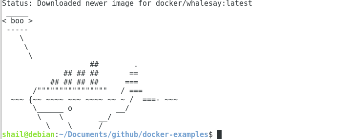
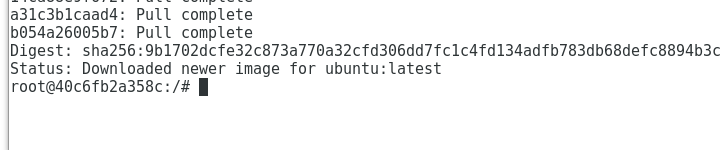
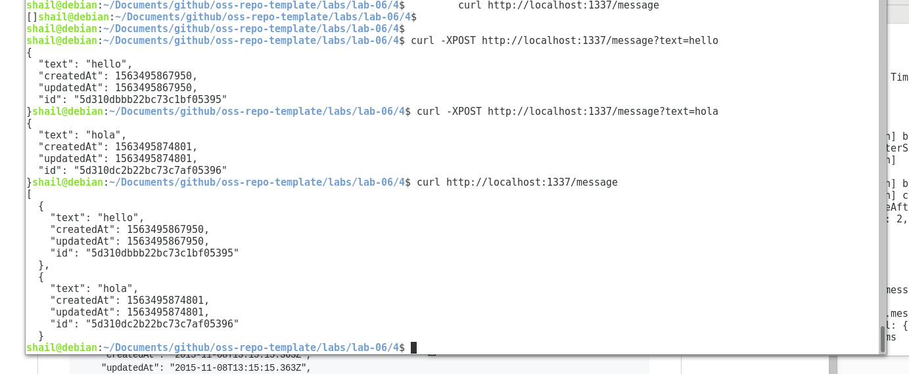
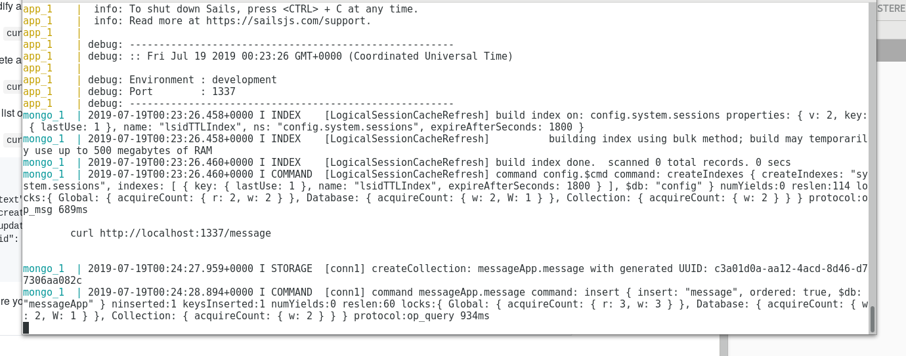

## example 00

Cowsay:

## example 01

Ubuntu container:

## example 02

## example 03

## example 04

Adding viewing new messages: 

Server running :

Docker seems really nice for some things but why does it take so much space?
This simple messaging app takes over 3.5GB. The ascii whale thing at step 1
took 250 MB which compared to the Unix cowsay is only 4.6K on my machine? I thought one of the selling points was that Docker is lighter than Virtual Boxes but it doesn't seem any better.