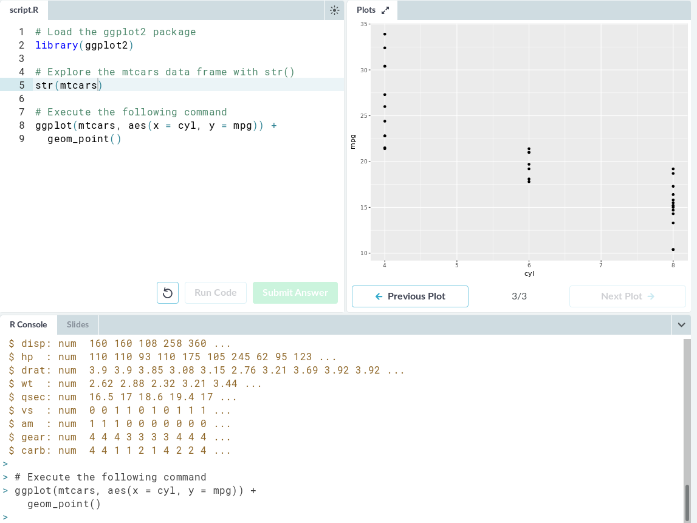
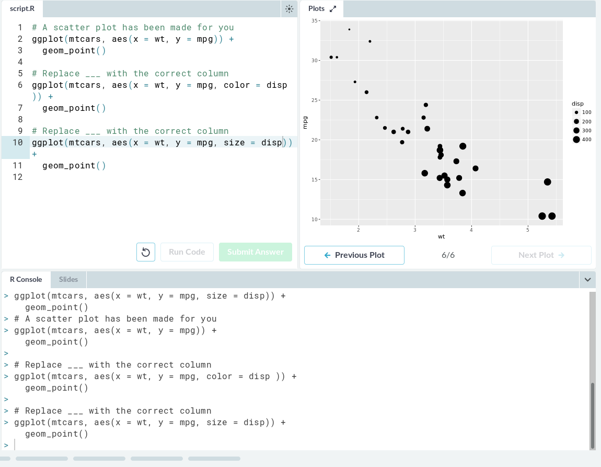
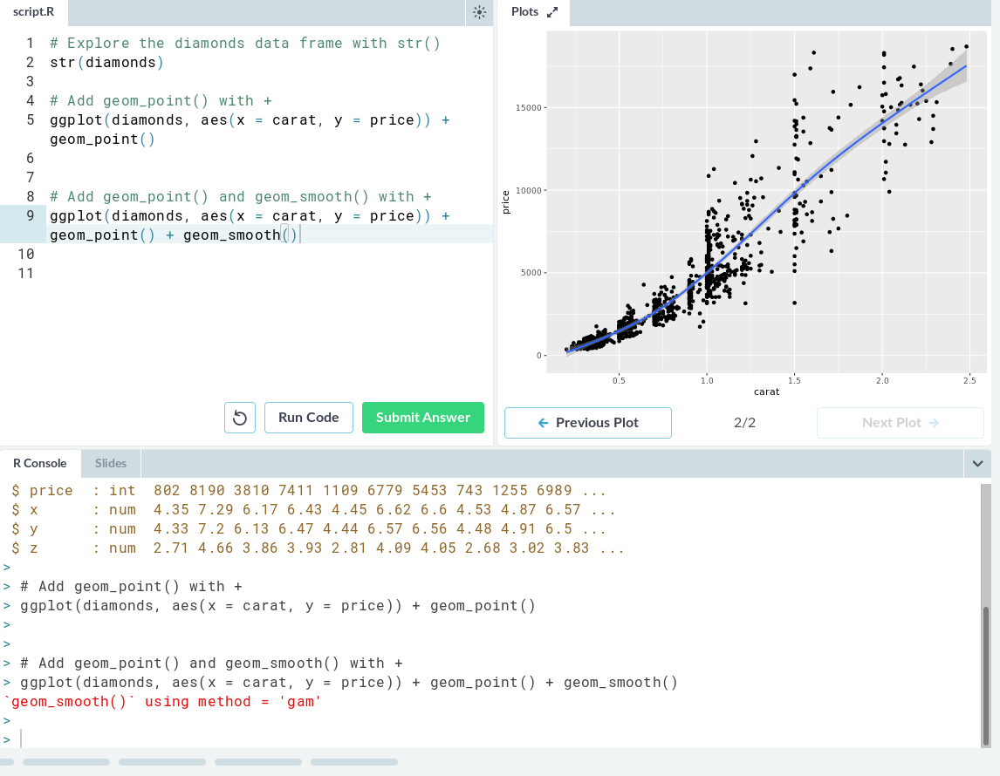
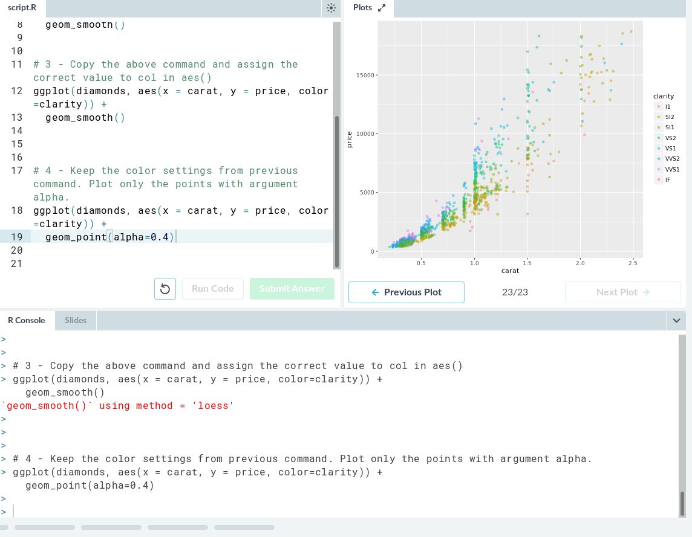
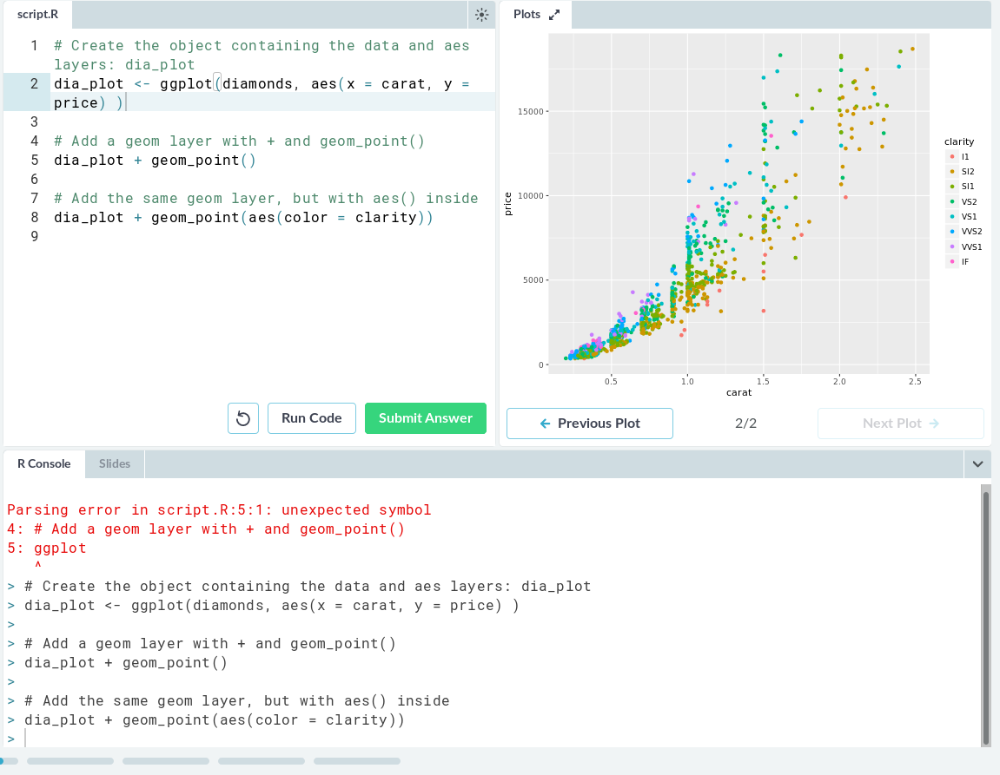
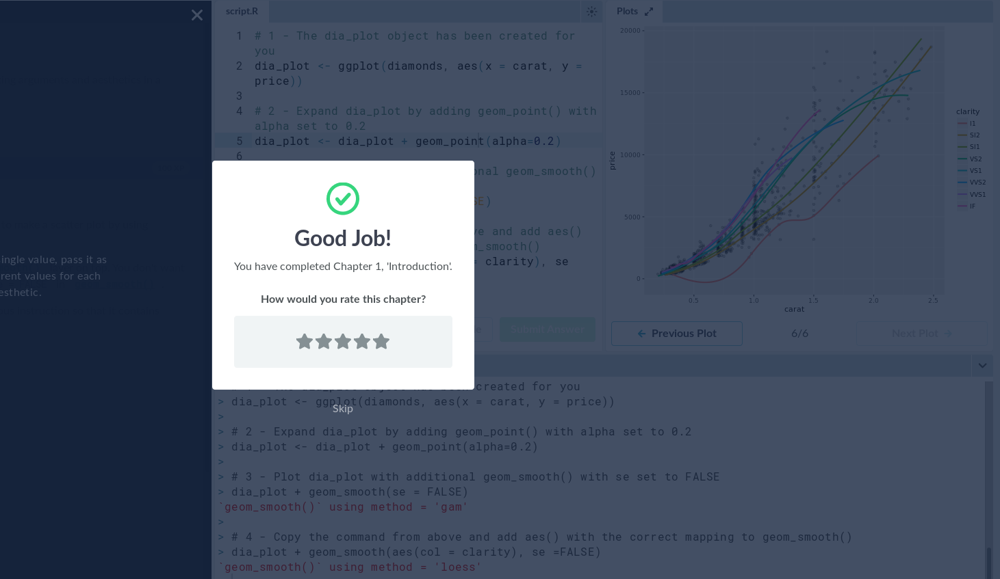
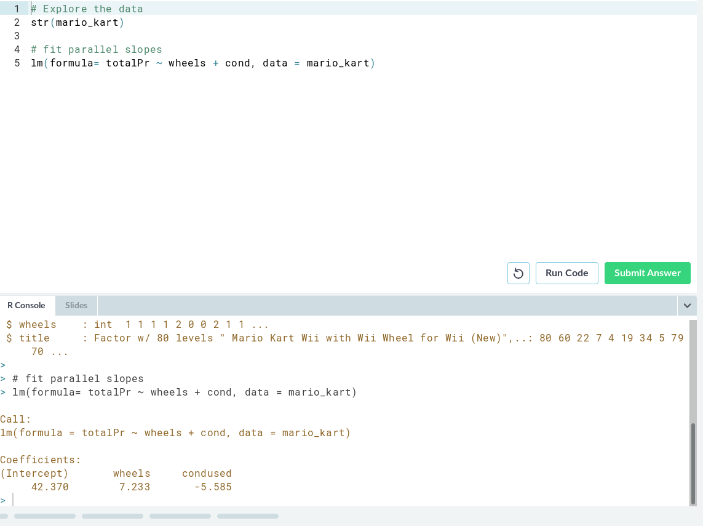
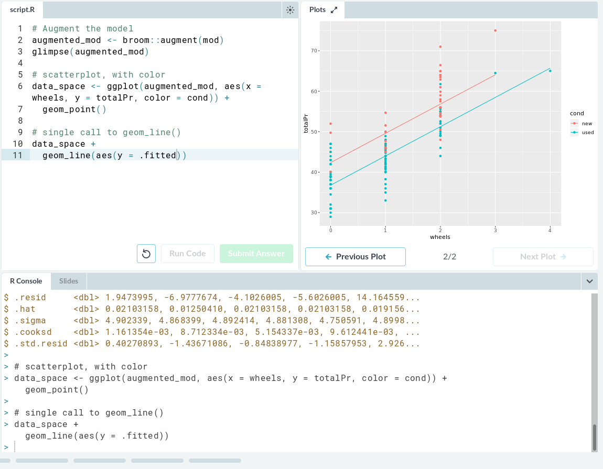
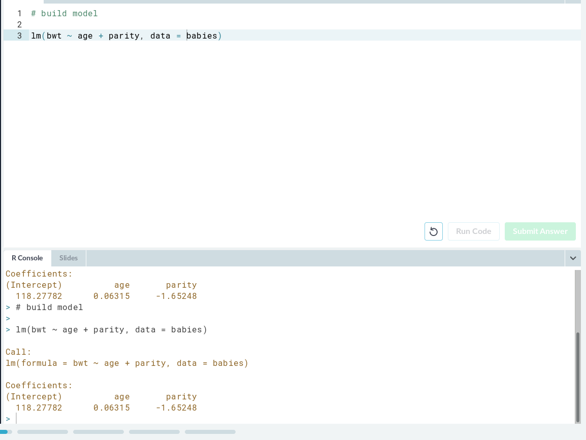
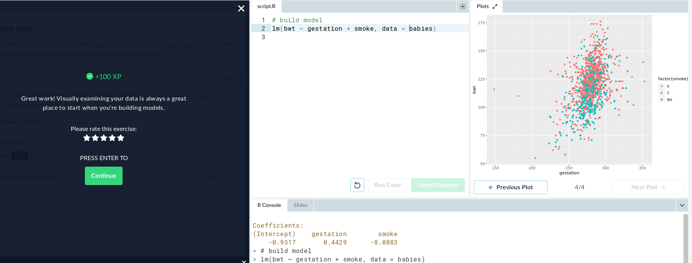

## 3
Data Visualization with ggplot2 (Part 1)

Here are the outputs of the different steps:

## 4
Parallel Slopes lesson of "Multiple and Logistic Regression"

My OSS project page on rcos.io:

https://rcos.io/projects/openbook-project/openbook-core/profile