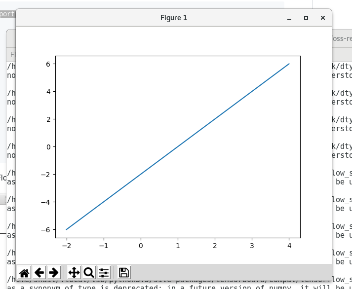
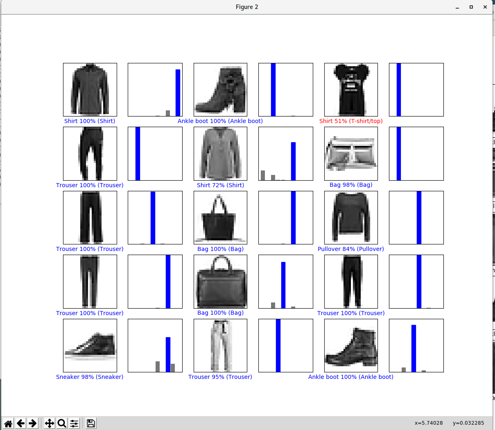
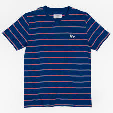
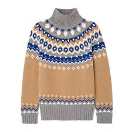

## checkpoint 1



## checkpoint 2



## checkpoint 3

### test1


[[1. 0. 0. 0. 0. 0. 0. 0. 0. 0.]]
T-shirt/top

### test2

[[0. 0. 0. 1. 0. 0. 0. 0. 0. 0.]]
Dress

### test3

[[0. 0. 0. 0. 1. 0. 0. 0. 0. 0.]]
Coat

I ran `pred = mode.predict(img)` 
The output was printed by:
```
print(pred)
print(class_names[np.argmax(pred[0])])
```
My output looks like its been ran through a softmax 
function but I couldn't get it to print the raw data

#### bonus:

Here is an image made by Submitty's bulk upload system
before it gets OCR'd


it also uses a MNIST standard image format

According to my trained network its a T-shirt/top


The koala bag according to Submitty's model is really the number 8

Who's right? the debate rages on

